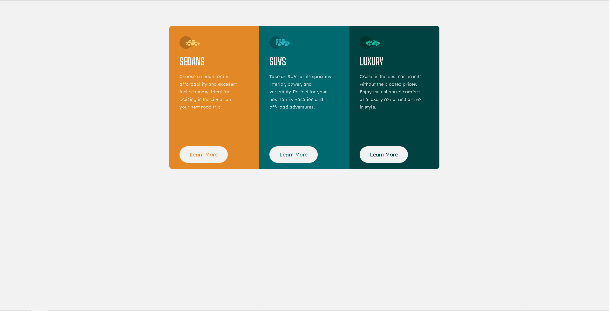

# Frontend Mentor - 3-column preview card component solution

This is a solution to the [3-column preview card component challenge on Frontend Mentor](https://www.frontendmentor.io/challenges/3column-preview-card-component-pH92eAR2-). Frontend Mentor challenges help you improve your coding skills by building realistic projects. 

## Table of contents

- [Overview](#overview)
  - [The challenge](#the-challenge)
  - [Screenshot](#screenshot)
  - [Links](#links)
- [My process](#my-process)
  - [Built with](#built-with)
- [Author](#author)

## Overview

### The challenge

Users should be able to:

- View the optimal layout depending on their device's screen size
- See hover states for interactive elements

### Screenshot

### Links

- Solution URL: [My solution](https://github.com/JeremyPaymal/3-columns-preview-card)
- Live Site URL: [Live website](https://3-column-prvw.netlify.app/)

## My process

### Built with

- Semantic HTML5 markup
- CSS custom properties

## Author

- Website - [JP Project](https://jp-project.com/)
- Frontend Mentor - [@JeremyPaymal](https://www.frontendmentor.io/profile/JeremyPaymal)
- Twitter - [@JeremyPaymal](https://twitter.com/JeremyPaymal)